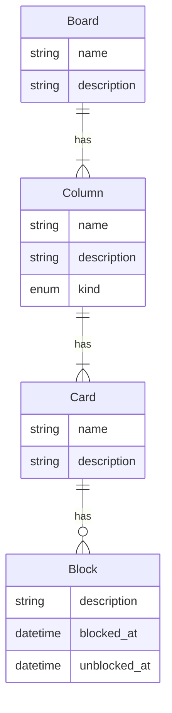

# DIO-board-de-tarefas

Foi proposto como tividade, um sistema de board de tarefas aonde:
- As tarefas estão no board.
- Os boards tem colunas.
- Pode mover as tarefas pelos boards
- As tarefas podem ser bloqueadas.
- As tarefas podem ser desbloqueadas, e deve informar o motivo.
- As colunas tem o tipo, Iniciado, pendente, concluido e cancelado, e só pode ter um tipo de cada com exceção das pendentes.
- Os cards podem ser movidos apenas para a coluna seguinte.

## Diagrama Criado para resolução do problema:

- Diagrama conceitual
